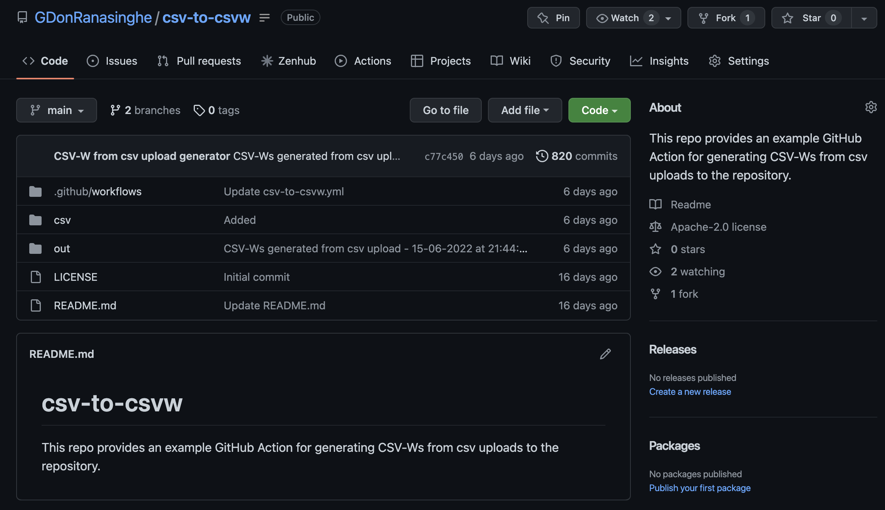
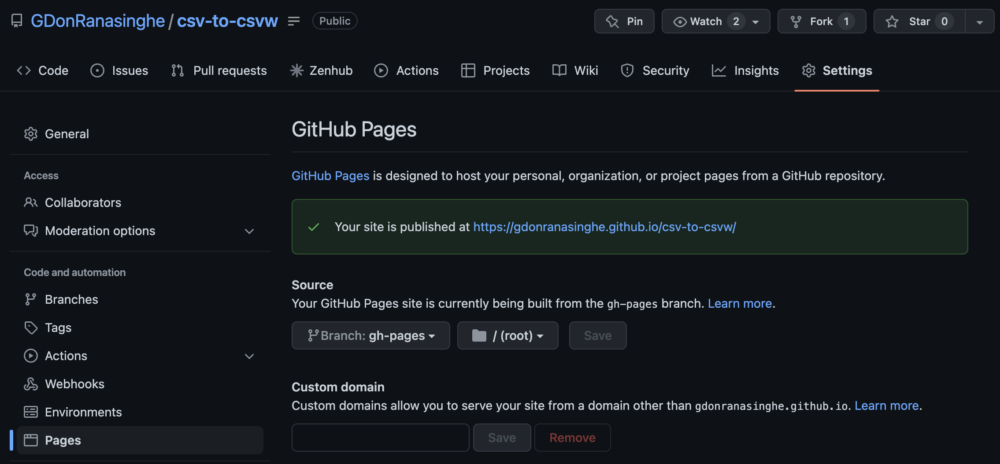
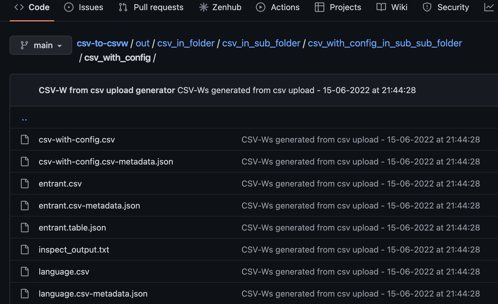
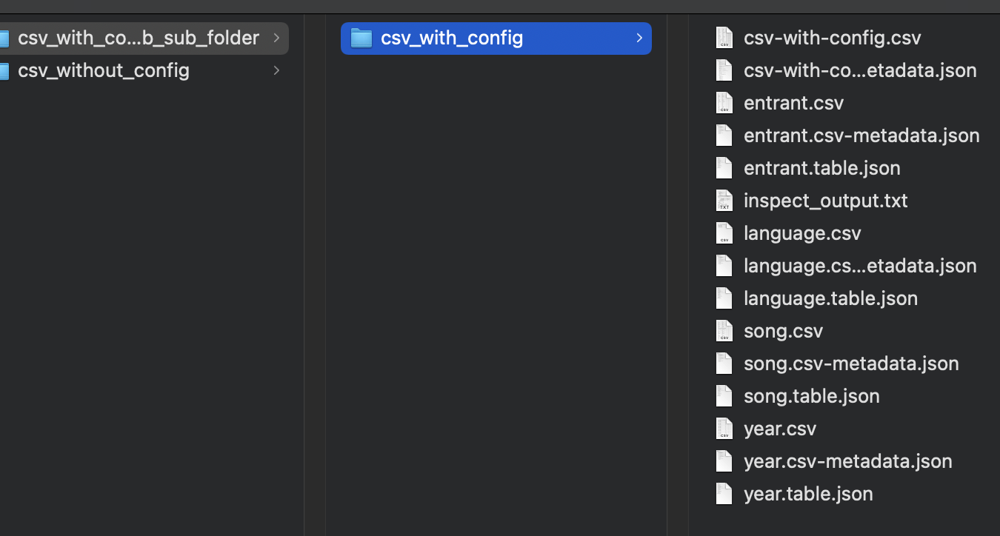
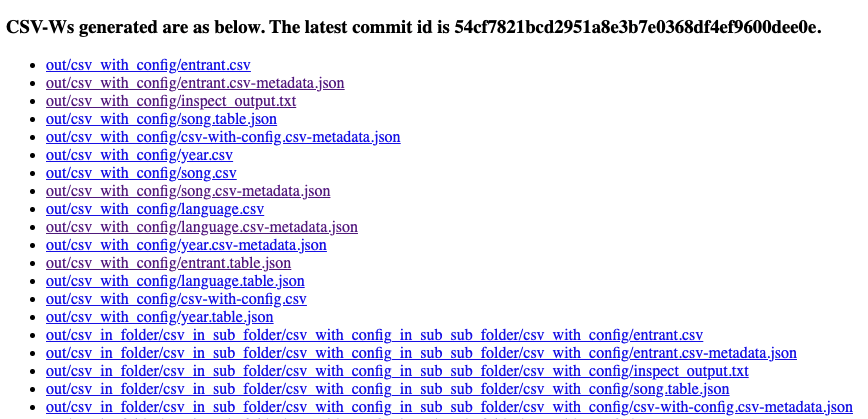

# Build with GitHub actions

The csvcubed [GitHub Actions script](https://github.com/GSS-Cogs/csv-to-csvw/blob/main/.github/workflows/csv-to-csvw.yml) enables you to build CSV-Ws by pushing CSV and [qube-config.json](configuration/qube-config.md) files to a Git repository configured with [Github Actions](https://docs.github.com/en/actions). It is designed to bring csvcubed to users who have difficulty installing software in corporate environments, or for those who want to keep a versioned history of their publications.

For information on how to install csvcubed locally, take a look at the [installation quick start](../quick-start/installation.md).

The remainder of this guide walks you through how the script works, and then guides you through the process of [setting up](#setup) your own GitHub repository which converts CSV inputs into CSV-Ws.

## Inputs 

The CSV-to-CSV-W GitHub action expects the user to organise the inputs as follows:

* The CSV files and their configuration JSONs need to be inside the `csv/` folder.
* If a CSV file has a configuration JSON, the filename of the configuration JSON needs to match the filename of the CSV file. For example, `my_data.csv` and `my_data.json`.

## Build process

In this section, an introduction to the key steps performed by this action is provided.

The GitHub action script can be observed in the [csv-to-csvw repository](https://github.com/GSS-Cogs/csv-to-csvw).

### 1. Triggering the job

The action is triggered when the user commits a CSV, and optionally a configuration file, to the `csv/` folder at the root of the repository. The user can commit these files in any preferred folder structure. An example set of files committed to the repository with various folder structures is available [here](https://github.com/GSS-Cogs/csv-to-csvw/tree/main/csv).

Commiting a file to any other location within the repository will NOT trigger a CSV-W build.

### 2. Building and inspecting CSV-Ws

On a new commit, the action runs the [`csvcubed build`](command-line/build-command.md) on any CSV or JSON files which have been changed. The outputs produced by the build command are saved using the same folder structure inside the `out/` folder at the root of the repository. For example, given a CSV file located at `my_folder/my_data.csv`, outputs will be written to the `out/my_folder/my_data/` folder.

The [`csvcubed inspect`](command-line/inspect-command.md) command is then run on all new or updated CSV-Ws; the output is then saved in an `inspect.txt` file next to each CSV-W output. For example, for the metadata JSON file at `out/my_folder/my_data/my_data.csv-metadata.json` a file, containing the [`csvcubed inspect`](command-line/inspect-command.md) command output, named `out/my_folder/my_data/inspect_output.txt` is also created. 

### 3. Producing outputs

#### `out` folder

The action creates an `out/` folder in the root of the repository upon completition, this helps to maintains a history of the outputs produced.

#### GitHub artifacts

The action publishes CSV-Ws and inspect command outputs to GitHub artifacts. The user can download a zip file consisting of the CSV-Ws and inspect command output from the artifacts section within the GitHub action run. More information on how to download the artifacts is available in the GitHub guide on how to [Download GitHub Action artifacts](https://docs.github.com/en/actions/managing-workflow-runs/downloading-workflow-artifacts).

#### GitHub Pages

The action also publishes the CSV-Ws and inspect command outputs to [GitHub Pages](https://pages.github.com/)' static file hosting. The script generates an `index.html` page listing the CSV-W outputs. The URL to access the GitHub page is provided in GitHub pages setting which is discussed in the [Setup](#setup) section below.

## Setup

To use the CSV-to-CSV-W GitHub action,

1. Ensure that you [created](https://github.com/signup) and/or [logged into](https://github.com/login) your GitHub user account.

2. Create a fork of the [csv-to-csvw](https://github.com/GSS-Cogs/csv-to-csvw) repository. Select your GitHub username as the `Owner` and give a name to the repository. Optionally, you can leave the `Repository name` as it is.

3. Then go to the newly forked repository's settings and set the branch for GitHub pages - under the `Source` section, set the `Branch` to `gh-pages` and set the folder location to `/(root)`. Also, keep a note of the URL at which your GitHub Pages site is published at.

4. The repository already consists of example inputs (see the `csv/` folder) and the generated outputs (see the `out/` folder). The users can use these input examples to familiarise themselves with the criteria discussed in [Organising Inputs](#organising-inputs).

5. Now that the repository has been forked and the GitHub pages settings are configured, you can commit and push your inputs using the GitHub web console.

6. Once the inputs have been committed, the action will automatically [run](#key-steps-performed-by-the-action). To see the progress of the action, go to the `Actions` section in the GitHub web console.

A more detailed view of the progress of the action can be seen by clicking on the action.

7. Once the CSV-to-CSVw action has finished, another action called `pages build and deployment` will run. This action is responsible for deploying the outputs to the GitHub pages.

8. Now we are ready to explore the outputs produced by the action. First look at the `out/` folder within the repository. If you are using the GitHub Desktop Client or the Github Command Line Interface, make sure to run `git pull` beforehand. The `out/` folder now consists of the CSV-Ws and inspect command logs generated for inputs committed to the repository.

Then download the artifacts produced by the GitHub action. The downloaded folder consists of the CSV-Ws and inspect command logs.

Finally, open the GitHub pages URL noted in Step 2 in the preferred web browser. A web page with all the outputs listed with downloadable links will appear in the browser.
.
